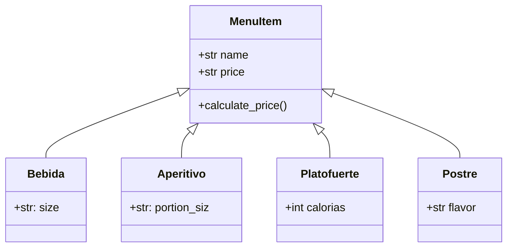

# Reto-3

```mermaid
classDiagram
    MenuItem <|-- Bebida
    MenuItem <|-- Aperitivo
    MenuItem<|-- Plato fuerte
    MenuItem<|-- Postre
    MenuItem: +str name
    MenuItem: +str price
    MenuItem: +calculate_price()
    class Bebida{
      +str: size
    }
    class Aperitivo{
      +str: portion_siz
    }
    class Plato fuerte{
      +int calorias
    }
    class Postre{
      +str flavor
    }
```
